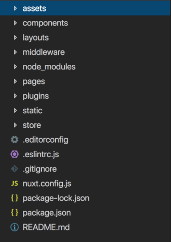
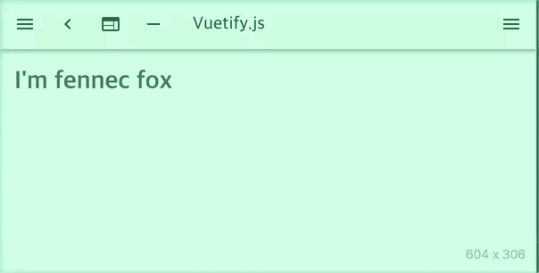

개발을 하다보면 여러 페이지에서 공통으로 사용하는 UI를 접하게 됩니다.
일반적으로 Input이나 Button, Typography 등이 그것이죠. 디자이너가 제공해준
목업에 따라 버튼의 사이즈, 폰트의 규격 같은 게 정해져 있고 이걸 하나의 컴포넌트로
개발함으로써 다른 컴포넌트에서 효율적으로 재사용할 수 있도록 만드는 것입니다.
이에 따른 이점은 다음과 같습니다.

📍 공통 코드를 덕지덕지 붙일 필요가 없다 (컴포넌트만 import 해주고 사용하면 됩니다.) <br>
📍 어느 페이지에서나 동일한 규격의 UI를 구현할 수 있다.<br>
📍 특정 attribute 값을 추가해줌으로써 필요에 맞게 최적화하기 쉽다. <br>

오늘은 vuetify라는 vue에서 사용하는 css framework의 구조를 참조해 screen 사이즈에 따라 폰트 사이즈를 변경하고 재사용이 가능한 typography 컴포넌트를 제작해보겠습니다.

최종 목표는 다음과 같습니다.

```html
  <typography xs="wg-heading-3" sm="wg-heading-2">
    키친
  </typography> <!-- 각 사이즈에 따라 폰트 크기가 달라진다. -->
```

저는 먼저 [vue init vuetifyjs/nuxt <project-name>] 커맨드를 통해 nuxt 템플릿 세팅을 완료했습니다.



(컴포넌트 만드는 방법은 동일하기 때문에 굳이 nuxt를 쓰지 않고 일반 spa vue 템플릿을 사용하셔도 됩니다. 저는 회사에서 nuxt + vuetify 조합을 사용하기 때문에 편의상 동일한 환경에서 진행하겠습니다. )

1. 먼저 components 폴더 안에 ui 폴더를 만들고 그 아래에 typography 폴더를 만듭니다. typography 폴더 안에는 typography.vue 파일을 만들어 줍니다.

```html
components
ㄴ ui
  ㄴ typography
    ㄴ typography.vue
```

typography.vue 컴포넌트에서 아래와 같이 작성해주세요.

```html
<template>
  <p>
    <slot>{{ text }}</slot>
  </p>
</template>

<script>
export default {
  name: 'Typography'
  props: {
    text: {
      type: String,
      default: ""
    }
  }
};
</script>

```
slot은 리액트로 따지면 props에 들어가는 children과 유사합니다. 상위 컴포넌트에서 텍스트를 넘겨주기 위해 사용했습니다. ```<p>text</p>``` 처럼 ``` <typography>text</typography>```를 만들고 싶은 것이죠. typography 컴포넌트를 열고 닫을 때 중간에 있는 태그 및 텍스트 값이 slot으로 넘어가게 됩니다. 자세한 내용은 [공식문서](https://vuejs.org/v2/guide/components-slots.html)를 참조해주세요. 

2. 다음으로 할 일은 p 태그에 동적으로 클래스를 바인딩 할 수 있도록 합니다.

```html
<template>
  <p
    :class="[typographyClass]"
  >
    <slot>{{ text }}</slot>
  </p>
</template>
<script>
  computed: {
    typographyClass() {
      const component = this;
      return 'xs';  
    }
  }
</script>  
```

vue에서 데이터 변화를 감시해주는 computed에서 typographyClass 함수를 프로퍼티 값으로 넘겨줌으로써 데이터의 변화에 따라 클래스를 동적으로 바꿀 수 있게 되었습니다. 지금은 임시로
'xs'라는 문자열을 리턴 값으로 할당해주었는데 사이즈에 따라 리턴 값이 달라질 수 있도록 한번 바꿔 보겠습니다.

```html
<script>
  const getDefaultClass = () => {
    return 'wg-default';
  };

  const getXsCLass = (component) => {
    return component.xs ? component.xs : getDefaultClass();
  };

  const getSmCLass = (component) => {
    return component.sm ? component.sm : getXsCLass(component);
  };

  props: {
    xs: {
      type: String,
      default: null
    },
    sm: {
      type: String,
      default: null
    },
  }

  computed: {
    typographyClass() {
      const component = this;

      switch (this.$vuetify.breakpoint.name) {
        case 'xs':
          return getXsCLass(component);
        case 'sm':
          return getSmCLass(component);
        default:
        return getDefaultClass(component);
      }
    }
  }
</script>
```

코드의 흐름이 보이시나요? 조금 복잡해졌습니다. 저는 typographyClass() 함수에서 screen 사이즈가 변경될 때마다 값이 업데이트 되는 this.$vuetify.breakpoint 변수를 사용했습니다. vuetify에서 제공해주는 값이기 때문에 이를 그대로 활용했지만 screen을 resize 할 때마다 사이즈를 측정하는 코드를 구현하는 건 어렵지 않으니 따로 작성하진 않겠습니다. <br><br>
위 코드는 사용자가 스크린을 resize 했을 때 this.$vuetify.breakpoint가 업데이트 되는데 computed가 이를 감지해서 screen 크기(name)에 따라 getXsCLass(), getSmCLass(component)를 실행시켜 줍니다. getXsCLass() 같은 함수에서는 return 값으로 component 객체에 할당된 xs나 sm의 프로퍼티 값을 반환함으로써 문자열을 읽어들이고 이를 ```<p :class="[typographyClass]">```에 바인딩을 하는 것이죠. component 객체에 할당되는 xs나 sm 등의 프로퍼티는 ```<typography xs="wg-heading-2" sm="wg-heading-1">test</typography>```처럼 typography 컴포넌트를 사용하는 부모에서 넘겨줄 수 있습니다. vuetify에서 정의하는 break point는 [다음](https://vuetifyjs.com/ko/framework/breakpoints)과 같기 때문에 screen 사이즈가 600 이하보다 작으면 getXsCLass() 함수가 실행되어 "wg-heading-2"라는 문자열이 ```<p :class="wg-heading-2">```와 같이 동적 클래스에 바인딩 됩니다. <br><br>
남은 일은 동적으로 바인딩 된 클래스에 스타일 속성을 부여하는 일입니다.
이어서 다음 style 코드를 작성해보겠습니다. (먼저 scss를 사용하기 전에 npm install --save-dev node-sass sass-loader로 설치를 해주시기 바랍니다.)

```css
<style lang="scss">
// Font colors
@import '../../../assets/scss/color.scss';

// Font weights
$black: 900;
$bold: 700;
$regular: 400;
$light: 300;
$thin: 100;

// Base definition
%base-typography {
  -webkit-font-smoothing: antialiased;
  -moz-osx-font-smoothing: grayscale;
  padding: 0;
  margin: 0;
}

.wg-heading-1 {
  @extend %base-typography;
  font-size: 2em;
  font-weight: $bold;
  color: $solid;
}

.wg-heading-2 {
  @extend %base-typography;
  font-size: 1.5em;
  font-weight: $bold;
  color: $solid;
}

.wg-default {
  @extend %base-typography;
  font-size: 0.75em;
  font-weight: $regular;
  color: $solid;
}
```

font color를 정의하는 scss 파일을 따로 분리했습니다. 자유롭게 작성해주시면 됩니다. Font weights도 물론 분리가 가능합니다.
위에서 말씀드렸다시피 screen size의 변화에 따라 클래스에 바인딩 되는 값이 달라지고 style 에서는 클래스 선택자에 css 속성들을 작성해주면 됩니다. xs일 경우에는 wg-heading-2 스타일이, sm일 경우에는 wg-heading-1 스타일이 적용이 되겠죠? 아무 값도 주지 않는다면 wg-default 문자열이 자동적으로 동적 클래스에 바인딩 됨으로써 .wg-default {...} 스타일이 적용될 것입니다. <br><br>
이렇게 코드를 작성할 경우 더 이상 미디어쿼리를 사용하지 않아도 되며 그때 그때 xs="" sm="" lg="" 값에 원하는 클래스 문자열을 입력할 수 있기 때문에 동일한 규격의 폰트 사이즈와 웨이트, 컬러 등을 손쉽게 사용할 수 있게 됩니다. 일반적으로 font-family와 color도 간단하게 ```<typography>``` 컴포넌트를 확장하여 해당 property를 넘겨줌으로써 공통으로 사용하는 속성들을 부여할 수 있습니다. color를 예로 들어보면 ```<typography gray>text</typography>```처럼 작성해서 text에 디자이너가 요구하는 회색 색상의 목업을 동일하게 줄 수 있는 것이죠. 다음과 같이 코드를 작성해주시면 가능합니다.

```html
  <template>
    <p :class="[typographyColor]">
      <slot>{{ text }}</slot>
    </p>
  </template>
  <script>
    props: {
      gray: {
        type: String,
        default: ''
      },
      blue: {
        type: String,
        default: ''
      }
    },
    computed: {
      typographyColor() {
        const { gray } = this;

        if (gray) return 'lightbrown';
        else if (blue) return 'blue';
        else return ''
      }
    }
  </script>
```
computed의 typographyColor 값을 typographyClass와 동일한 방법으로 p 태그의 클래스에 동적으로 바인딩 했습니다.
마찬가지로 gray 프로퍼티를 넘겨주면 클래스에 gray 문자열이 바인딩 되고 blue 프로터피를 넘겨주면 클래스에 blue 문자열이 바인딩 됩니다.
그러면 다음으로 scss를 작성함으로써 해당되는 클래스 선택자에 스타일 속성을 부여해주면 되겠죠?

```css
  .gray {
    color: $gray;
  }

  .lightbrown {
    color: $lightbrown;
  }
```

그럼 이제껏 작성한 typography 컴포넌트를 pages에서 사용해 볼까요? 다음처럼 컴포넌트를 import 한 뒤 components 객체에 할당해주고 템플릿 태그를 작성하면 사용이 가능합니다.

```html
<!-- pages/index.vue -->
<template>
  <div>
    <typography xs="wg-heading-2" sm="wg-heading-1" gray>
      I'm fox lee
    </typography>
  </div>
</template>

<script>
import typography from "@/components/ui/typography/typography";
export default {
  components: {
    typography
  }
};
</script>

```


최종 결과물은 다음과 같습니다.




